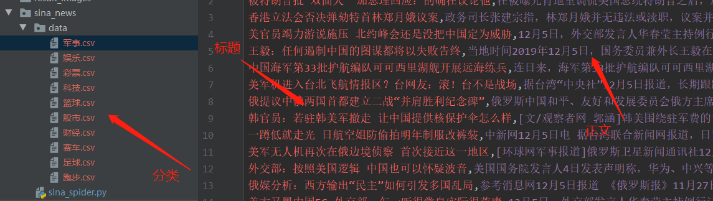
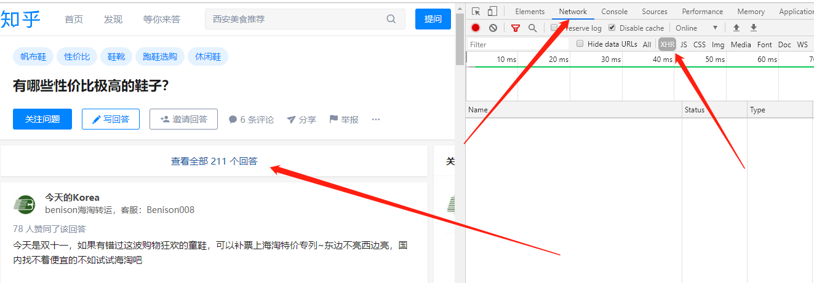
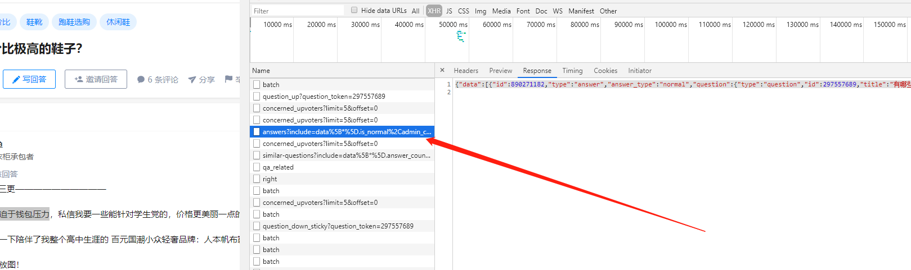
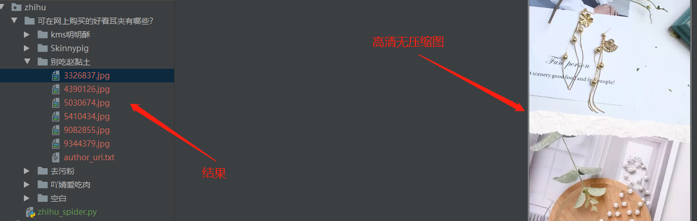

### 新浪滚动新闻爬取
* `sina_news/sina_spider.py` 是爬取新浪新闻的代码，只爬取了新闻标题和新闻正文内容

* 新浪滚动新闻页面 : 
[https://news.sina.com.cn/roll/#pageid=153&lid=2513&k=&num=50&page=1]

* 该页面是动态加载的所以要是用以下url(也可以使用selenium来爬上面的链接):
[https://feed.mix.sina.com.cn/api/roll/get?pageid=153&lid=2513&k=&num=50&page=1&r=0.18348811960604383]

* 爬取结果:

### 知乎爬虫
* `zhihu/zhihu_spider.py` 是爬取新浪新闻的代码，只爬取了某个问题下的图片和作者主页信息

* 使用返回json的链接，先找到一个问题，然后在F12的XHR里面，再点击查看所有答案找到该url,比如这个链接
[https://www.zhihu.com/api/v4/questions/312744244/answers?include=data%5B*%5D.is_normal%2Cadmin_closed_comment%2Creward_info%2Cis_collapsed%2Cannotation_action%2Cannotation_detail%2Ccollapse_reason%2Cis_sticky%2Ccollapsed_by%2Csuggest_edit%2Ccomment_count%2Ccan_comment%2Ccontent%2Ceditable_content%2Cvoteup_count%2Creshipment_settings%2Ccomment_permission%2Ccreated_time%2Cupdated_time%2Creview_info%2Crelevant_info%2Cquestion%2Cexcerpt%2Crelationship.is_authorized%2Cis_author%2Cvoting%2Cis_thanked%2Cis_nothelp%2Cis_labeled%2Cis_recognized%2Cpaid_info%2Cpaid_info_content%3Bdata%5B*%5D.mark_infos%5B*%5D.url%3Bdata%5B*%5D.author.follower_count%2Cbadge%5B*%5D.topics&offset=0&limit=20&sort_by=updated]

* 寻找方法：

* 爬取结果:
