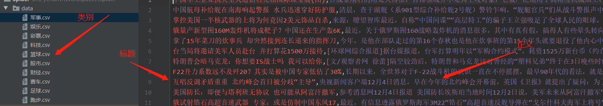

`sina_spider.py` 是爬取新浪新闻的代码，只爬取了新闻标题和新闻正文内容

新浪滚动新闻页面 : 
https://news.sina.com.cn/roll/#pageid=153&lid=2513&k=&num=50&page=1

该页面是动态加载的所以要是用以下url(也可以使用selenium来爬上面的链接):
https://feed.mix.sina.com.cn/api/roll/get?pageid=153&lid=2513&k=&num=50&page=1&r=0.18348811960604383

爬取结果:
